# モーション動画（layout: motion）

文字・数字・グラフ・3D がテンポよく動く動画。製品・技術の紹介、音に合わせた MV 風、データや歴史の物語、3D・エフェクト重視の映像を作る。
画面はすべてコードで描き、BGM もコードで合成する（同じ台本なら毎回同じ動画になる）。

作り方は2通りあり、1本の中で混ぜてよい。

| | 組み込みの部品 | 場面のコード（`:::custom`） |
| --- | --- | --- |
| 書くもの | 台本だけ | 台本＋場面ごとの TSX（React / SVG / Canvas / Three.js） |
| 向いている | 大きな文字・数字・グラフ・年表・題名・背景・画面写真・定番の 3D | 部品にない表現（独自の図形・図解のアニメーション・凝った 3D） |
| 安定性 | 高い（検査が中まで測れる） | 書いたコード次第（検査は文字の位置と大きさだけ見る） |

見本：`examples/motion/` の `launch.md`（製品紹介）・`mv.md`（MV 風）・`data-story.md`（ナレーション付きの年表と数字）・`showcase.md`（3D と場面のコード）。

## 台本

```markdown
---
title: gmm 紹介
layout: motion
bpm: 120                 # テンポ。場面の長さと切り替わりは拍にそろう
bgm: synth:drive         # コードで合成する曲（drive / tech / epic / chill。@C で調も変えられる: synth:drive@C）
theme: night             # 省略時は night（暗い背景）
subtitles: none          # ナレーションがあれば burn で字幕
---

## オープニング beats=8                 ← 場面。beats= で長さ（拍）
:::backdrop style=grid :::               ← 1行で閉じる書き方
:::hero style=reveal {beat:1}
gmm
台本から、動画へ。
:::

## 問い beats=8 transition=flash         ← transition= で入り方
:::kinetic every=2
動画づくり、
**時間**かかる？                          ← **語** はアクセントの色
:::

## 年表 transition=wipe                   ← beats= を省略すると、ナレーションの長さを拍に切り上げる
:::history
- {1} 1969: ARPANET が動き出す            ← {n}: n 番目の文で出す
- {2} 1991: WWW が公開される
:::
始まりは1969年なのだ。
1991年には、WWWが公開されたのだ。
```

- 部品は**層**。後に書いたものほど上に重なる（背景 → 3D → 文字 の順に書く）
- 出すタイミング：`{n}`（n 番目の文）か `{beat:n}`（場面の n 拍目。1 拍目が場面の頭）。なければ場面の頭
- 入り方：`cut`（既定）/ `fade` / `wipe` / `zoom` / `slide` / `flash` / `glitch`。`wipe` `slide` `zoom` は「シュッ」、`flash` `glitch` は「ドン」の効果音が自動で鳴る
- ナレーション（任意）は解説動画と同じ書き方（`{表記|よみ}`・`readings:`・`speakers:` の「話者: 文」）。立ち絵は出ない
- BGM は既定で大きめ（`bgmVolume: 0.8`）。ナレーション中は自動で下げる
- 時間の目安：120 BPM なら 1 拍 0.5 秒、8 拍 4 秒。MV 風は 8 拍ごとに場面を変えると気持ちよい

## 組み込みの部品

見本の画像は [motion/gallery.md](motion/gallery.md) から作っている（`scripts/parts-docs.sh` で作り直す）。

### `:::kinetic` 大きな文字

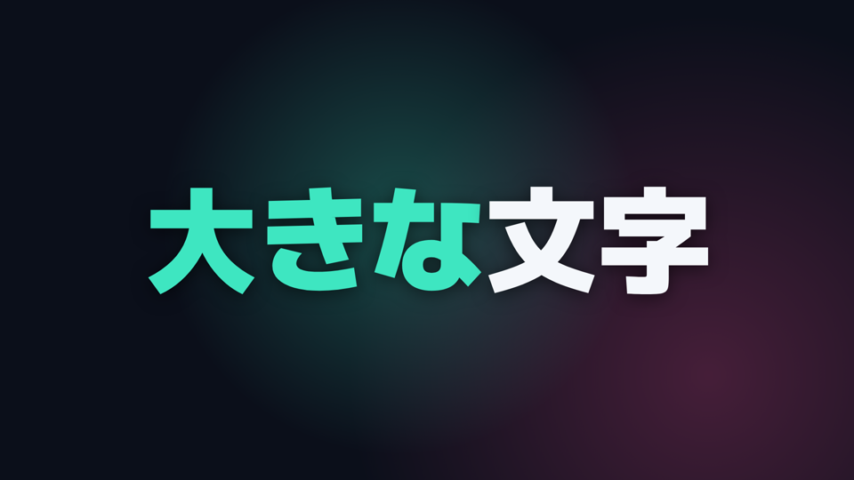

```markdown
:::kinetic style=pop mode=replace every=1 {beat:1}
**大きな**文字
次の行
:::
```

| 引数 | 意味 |
| --- | --- |
| `style=` | `pop`（弾む・既定）/ `slide`（下から）/ `type`（1文字ずつ）/ `blur`（ぼかしから） |
| `mode=` | `replace`（行が入れ替わる・既定）/ `stack`（積み重なる） |
| `every=` | 時刻のない行を何拍ごとに出すか（既定 1） |
| `size=` | 文字の大きさ（px）。省略時は行の長さから決める |

1 行は 16 文字まで（検査が `kinetic-long` で知らせる）。行ごとに `{n}` / `{beat:n}` も付けられる。

### `:::counter` 数え上がる数字

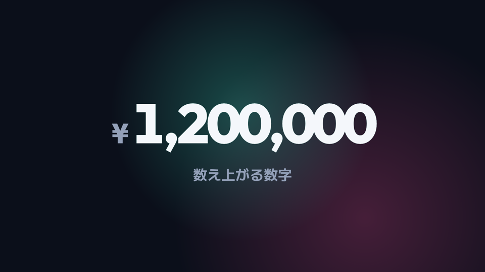

```markdown
:::counter value=1200000 from=0 prefix=¥ suffix=+ decimals=0 beats=4
下に出す説明
:::
```

### `:::chart` グラフ

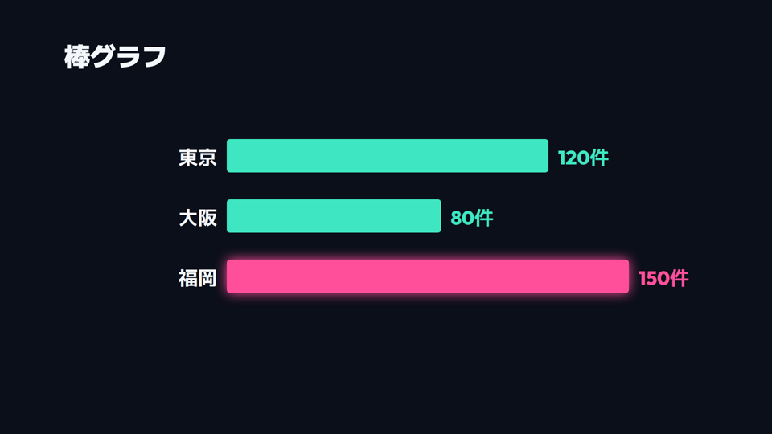 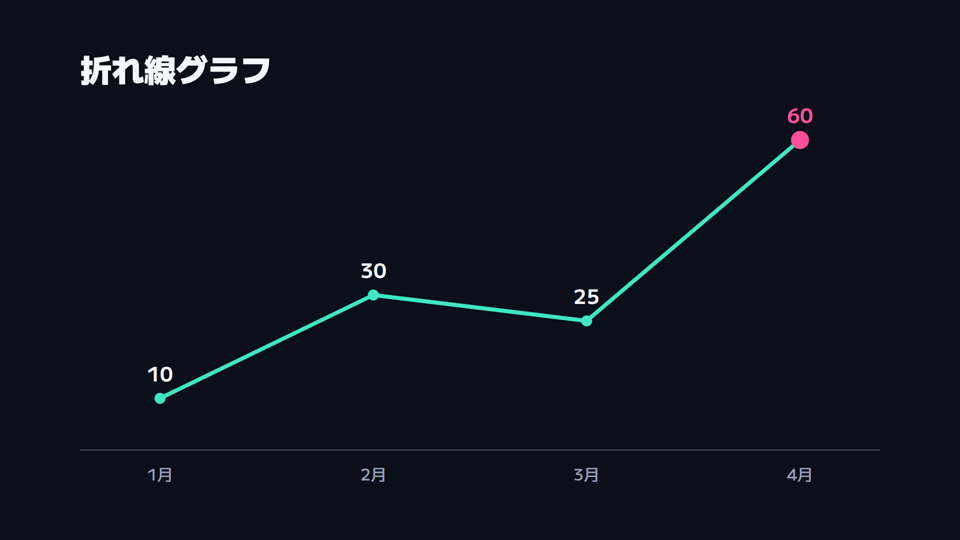

```markdown
:::chart kind=bar title="1本作るのにかかる時間" unit=時間 beats=4
- 手作業: 8
- gmm: 0.5 !            ← 最後の ! で強調（2つ目のアクセントの色）
:::
```

`kind=bar`（横棒・既定）/ `kind=line`（折れ線）。`beats=` 伸びきるまでの拍数。

### `:::history` 年表

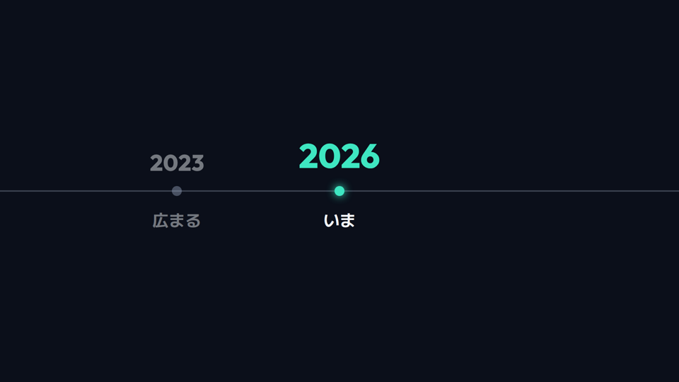

```markdown
:::history every=2
- 1969: ARPANET が動き出す
- {2} 1991: WWW が公開される
:::
```

項目が順に出て、いまの項目が画面の中央に来るように横に送る。

### `:::hero` 大きな題名

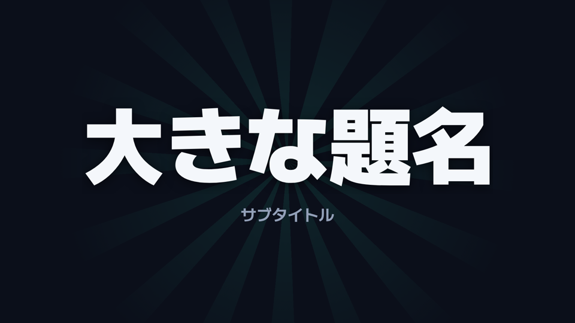

```markdown
:::hero style=reveal
大きな題名
サブタイトル
:::
```

`style=` は `reveal`（色の帯が走って文字が残る）/ `zoom`（奥から迫る）/ `split`（上下に割れて出る）。

### `:::backdrop` 動く背景

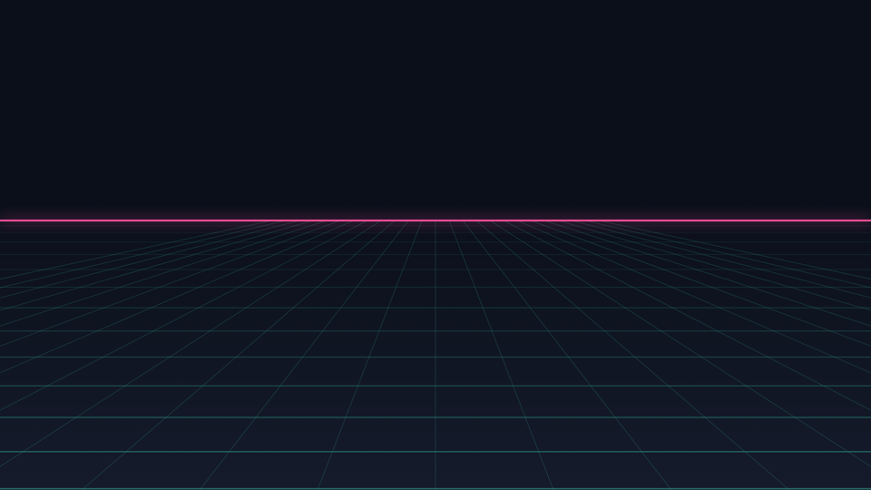 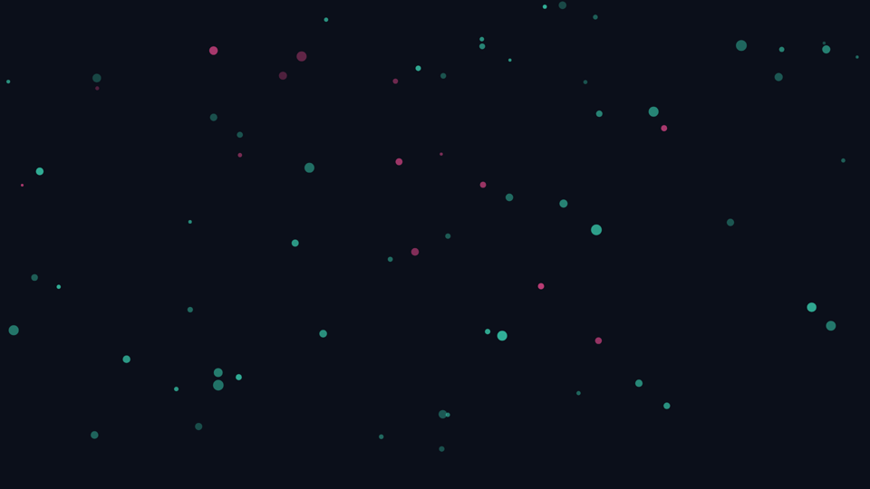

`style=` は `gradient`（既定）/ `grid` / `particles` / `rays` / `stars`。どれも拍に合わせて脈打つ。

### `:::shot` 画面写真

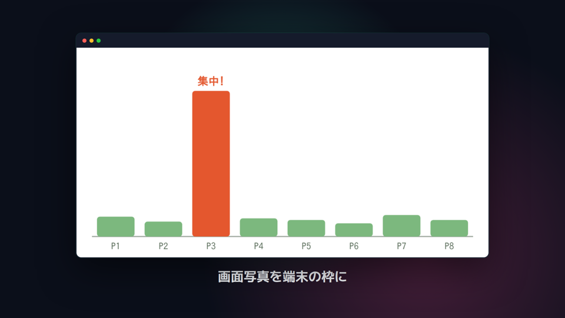

```markdown
:::shot src=assets/screen.png frame=browser zoom=1.08
キャプション
:::
```

`frame=` は `browser` / `phone` / `none`。ゆっくり寄る（`zoom=1` で寄らない）。

### `:::three` 組み込みの 3D

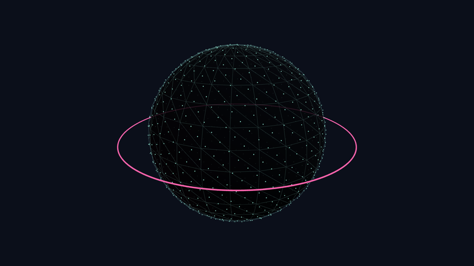 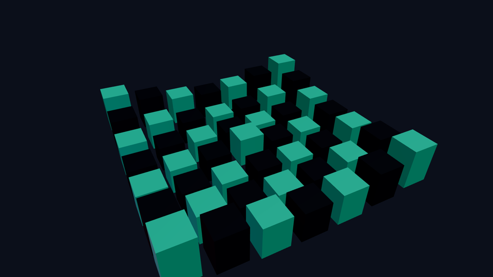

`preset=` は `cubes`（波打つ立方体）/ `globe`（点の地球儀）/ `particles`（渦を巻く粒）/ `rings`（回る輪）。

### `:::terminal` ターミナル

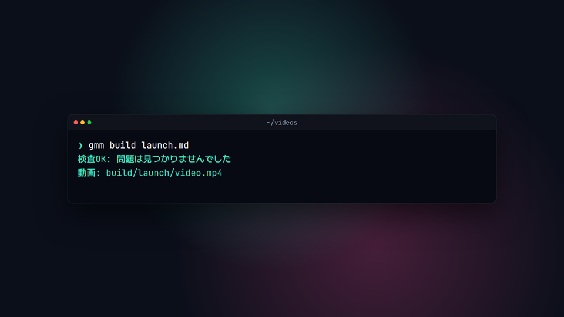

```markdown
:::terminal title="~/videos" area=right every=1 {beat:2}
$ gmm build launch.md                 ← $ の行は1文字ずつ打ち込まれる
検査OK: 問題は見つかりませんでした      ← それ以外は出力（[ERROR] は赤、[WARN] は黄、検査OK・動画: は色付き）
:::
```

### `:::editor` エディタ

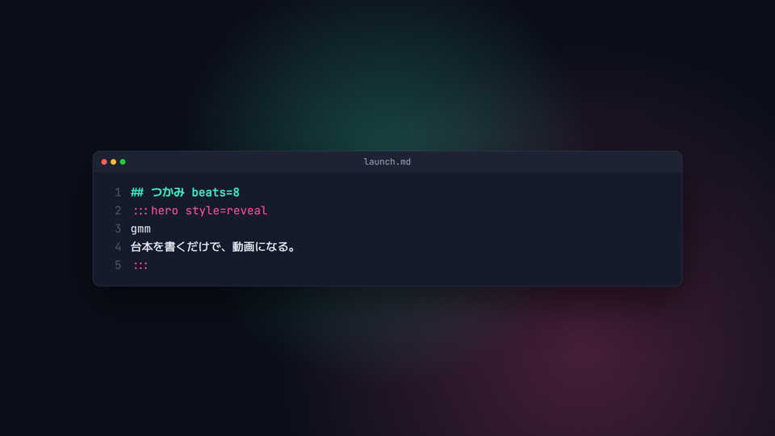

```markdown
:::editor src=../duo/http-status.md lines=37-48 area=right beats=12
:::
```

`src=`（台本からの相対パス）と `lines=` で手元のファイルを見せる。本文に直接書いてもよい（単独の `:::` は `\:::` と書く）。
`typing=false` で最初から全部出す。`beats=` は打ち終わるまでの拍数。長い行は折り返す。

### `:::clip` 書き出した動画を流す

```markdown
:::clip src=../../build/http-status/video.mp4 start=18.5 area=tl
解説・掛け合い
:::
```

ほかの動画（gmm で書き出したものなど）の一部を、ブラウザ（`frame=browser`・既定）やスマホ（`frame=phone`）の枠で流す。
`start=` / `end=` は元の動画の秒。音は出さない。先にその動画を書き出しておく。

### `:::features` できることの一覧

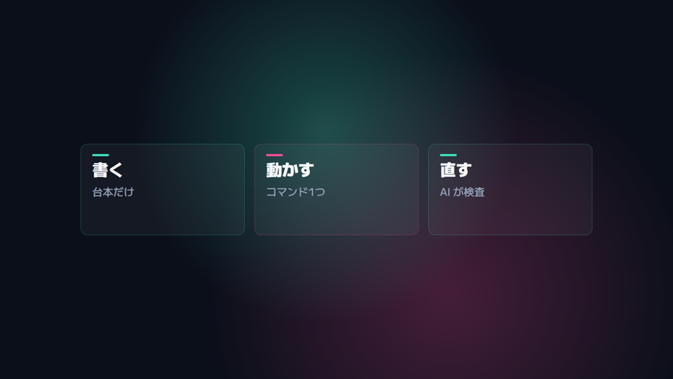

```markdown
:::features every=1 columns=3
- 解説動画: ずんだもんが説明
- ゲーム実況: 録画に実況
:::
```

### 置き場所 `area=`

どの部品にも `area=` を付けられる。`full`（既定）/ `left` / `right` / `top` / `bottom` / `tl` `tr` `bl` `br`（四隅）/ `center`。
ターミナル・エディタ・動画・一覧は、書かなければ `center`。説明の文字を `left`、エディタを `right` に置くと「書いている様子」になる。

## 製品紹介の組み立て方

何ができて、どう使うのかを**使っている様子**で見せる（`examples/motion/launch.md`）：

1. つかみ（`hero`）→ 問い（`kinetic`）
2. 手順ごとに「左に説明の文字（`kinetic mode=stack area=left`）、右に実物（`editor` / `terminal`）」
3. できたもの（`clip` を四隅に並べる）
4. できること（`features`）→ 締め（`hero`）

## フォント

テーマ `night` は Google Fonts の **M PLUS 1**（本文・日本語）と **Outfit**（大きな文字・数字の英数字）を使う。
テーマ JSON の `fontFamily` / `displayFontFamily` / `numberFontFamily` で変えられる（`fonts:` でフォントファイルも足せる）。

## 場面のコード `:::custom`

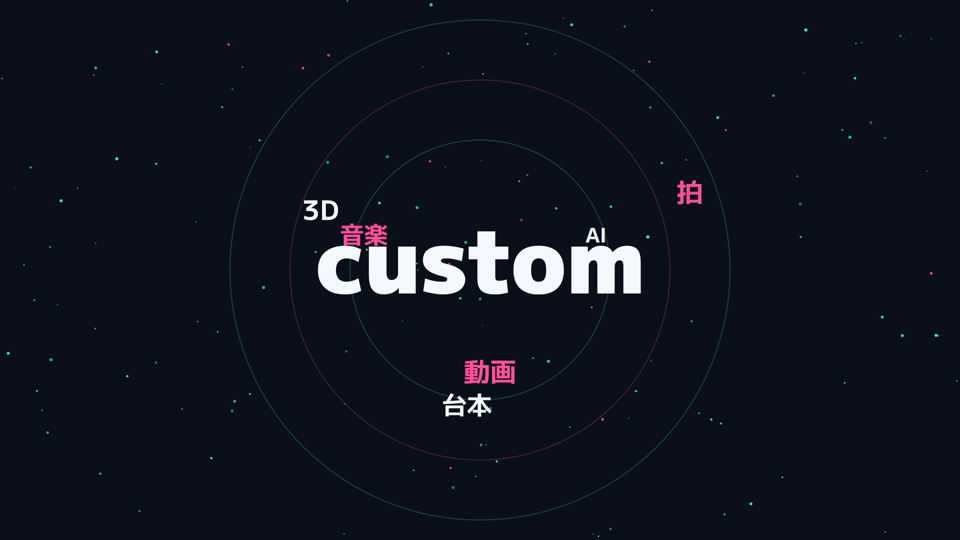

```markdown
:::custom src=scenes/orbit-words.tsx center=gmm words="AI,動画,台本" :::
```

`src` は台本からの相対パス。残りの `key=value` は `props` として渡る（本文に `key: value` の行で書いてもよい）。

```tsx
// scenes/orbit-words.tsx
import { ease, random, type MotionSceneProps } from "gmm-motion";

export default function OrbitWords({ frame, width, height, beat, palette, props }: MotionSceneProps) {
  const intro = ease(frame, beat.framesPerBeat * 2); // 2拍かけて出る
  return (
    <svg width={width} height={height}>
      <text x={width / 2} y={height / 2} fontSize={180 * (1 + 0.05 * beat.pulse)} fill={palette.text} opacity={intro}>
        {props.center}
      </text>
    </svg>
  );
}
```

受け取るもの（`MotionSceneProps`）：

| 名前 | 中身 |
| --- | --- |
| `frame` | 部品が出てからのフレーム（`useCurrentFrame()` と同じ） |
| `fps` / `width` / `height` / `durationInFrames` | 画面と、部品が出てから場面の終わりまでの長さ |
| `beat` | `framesPerBeat`・`index`（何拍目か・小数）・`pulse`（拍の頭で 1 → 0 に落ちる） |
| `palette` | テーマの色（`background` `text` `accent` `accent2` など）とフォント |
| `props` | 台本に書いた `key=value` |

`gmm-motion` の道具：`ease(frame, len)`・`pop(frame, fps)`・`random(seed)`・`beatInfo`・`splitEmphasis`・`formatNumber`。
`remotion`（`interpolate` `spring` など）・`@remotion/three`（`ThreeCanvas`）・`three` も使える。3D の例は `examples/motion/scenes/tunnel.tsx`。

決まり（`gmm check` / 書き出しの前に調べ、守っていなければ止まる）：

- `export default` で部品を書き出す
- `Math.random()`・`Date`・`performance.now()`・`fetch()` は使わない（同じ台本なら同じ動画になること。乱数は `random(seed)`）
- 姿はフレーム番号だけから決める（前のフレームの状態を持ち越さない。場面ごと・フレームごとに書き出すため）
- 文字には `data-gmm-text` を付けると、はみ出しと大きさを検査できる

## 検査

`gmm check` は、部品が出て落ち着いたフレームごとに画面を測る。

- 文字が画面の端（48px）からはみ出していないか、28px より小さくないか
- 字幕と文字が重なっていないか（ナレーションがあるとき）
- ナレーションが `beats=` の長さに収まっているか（`motion-narration-long`）
- 大きな文字が長すぎないか（`kinetic-long`）、入れ替わりが速すぎないか（`kinetic-fast`、0.4 秒未満）

`gmm frames <台本> --steps` で、部品が出るたびの画面を撮れる。
