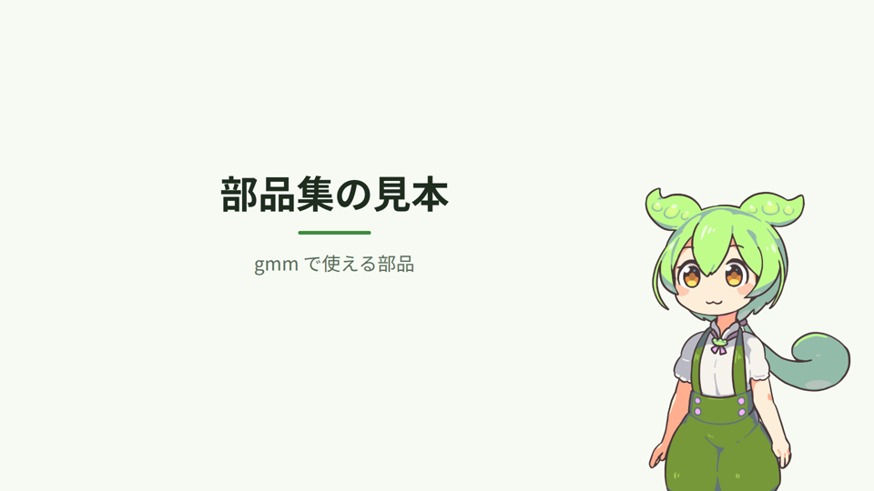
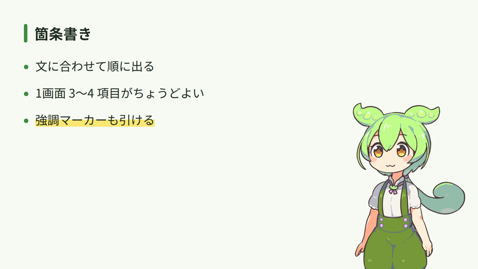
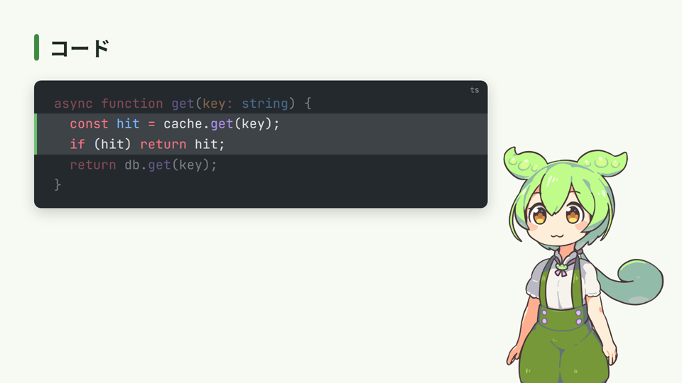
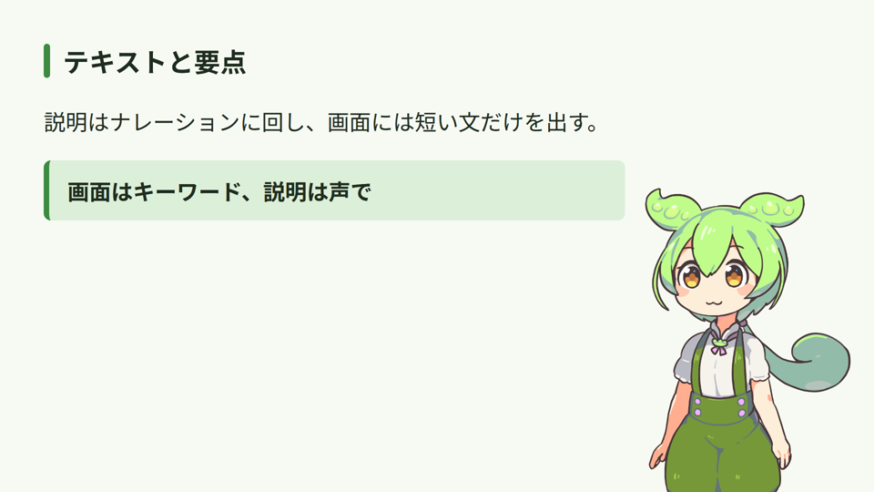
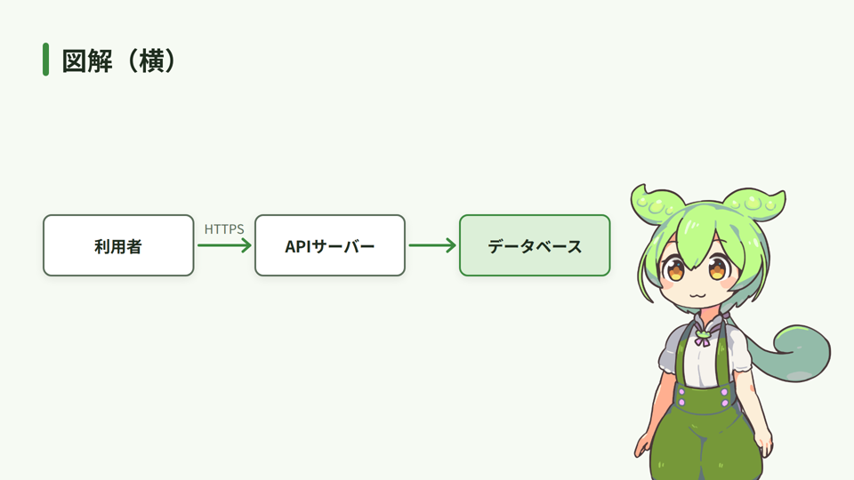
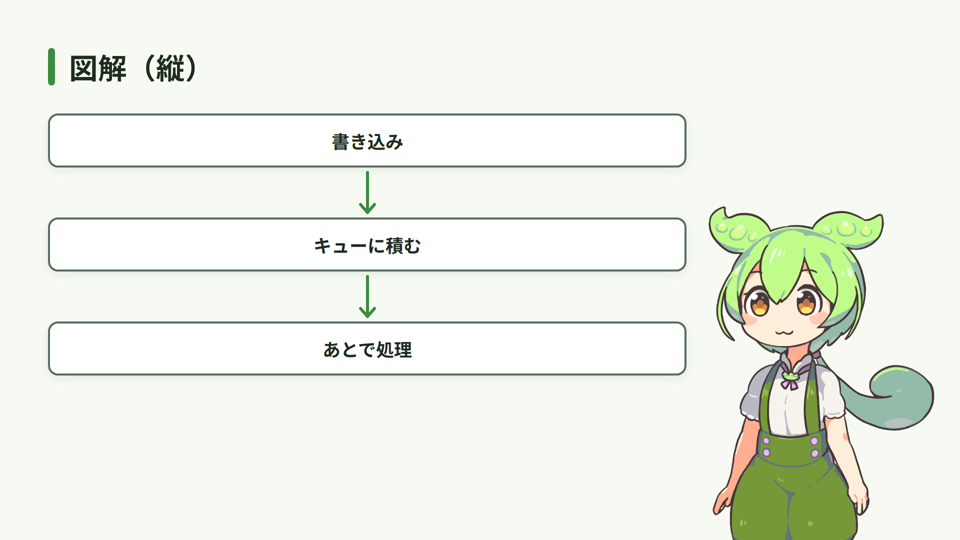
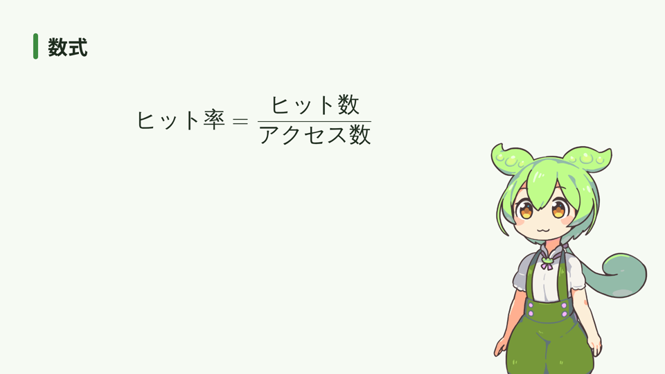
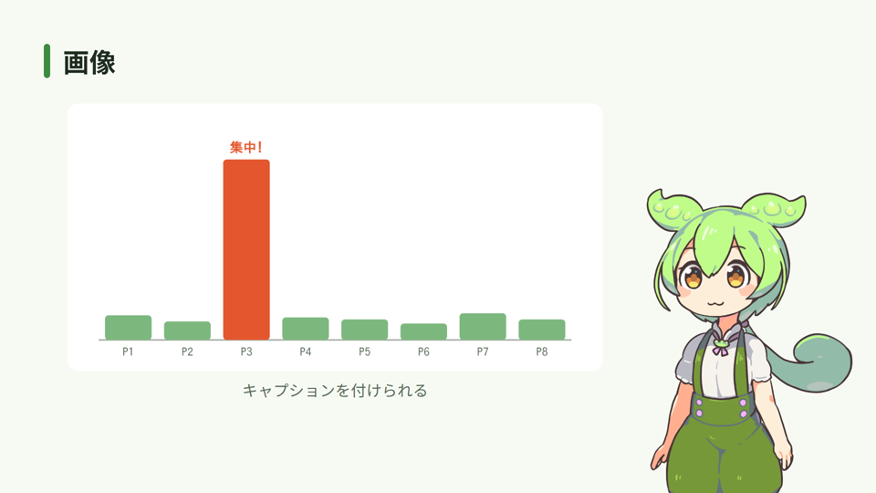
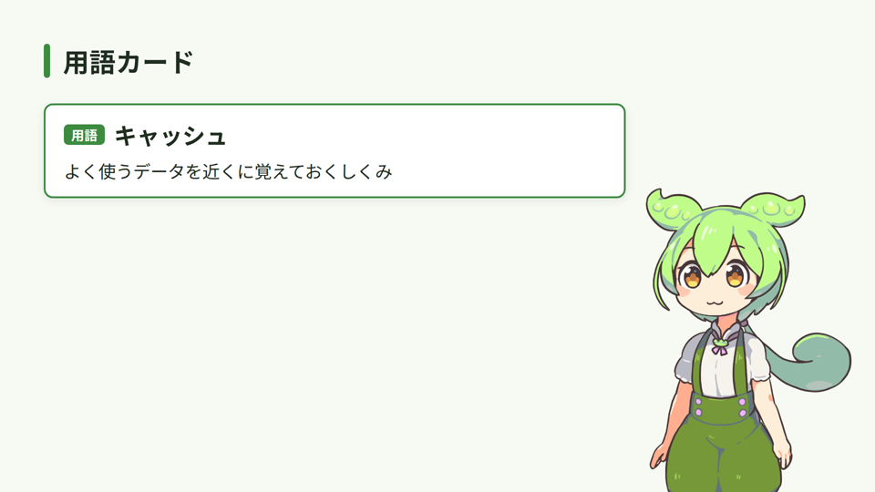

# 部品集

解説動画の画面に出せる部品の一覧。台本では `:::部品名 引数` から `:::` までで1つの部品を書く。
見本の画像は [parts/gallery.md](parts/gallery.md) から作っている（部品の見た目を変えたら `scripts/parts-docs.sh` で作り直す）。

## 共通のきまり

- **出すタイミング**：`{n}` を付けると、そのシーンの n 番目の文が始まるときに出る。付けなければシーンの冒頭から出る
- **強調**：`{!n}` を付けると、n 番目の文で強調マーカーを引く（箇条書きの項目・図解の箱）
- **並べ方**：部品はシーンの中で上から順に縦に積まれる。立ち絵と字幕の場所は自動で空く
- **量の上限**（`gmm check` が見る）：1画面 160 文字まで、文字は 28px 以上、画面の端から 48px 内側、部品どうし・字幕と重ならない、
  出てから 1.5 秒以上見せる
- 部品を足すときは `remotion/parts/` に置き、`src/schema.ts`・`src/parse.ts`・`src/timeline.ts`・`src/inspect/rules.ts` を合わせて直す（CLAUDE.md）

## タイトル `:::title`



```markdown
:::title
部品集の見本          ← 1行目：題名
gmm で使える部品      ← 2行目：サブタイトル（省略可）
:::
```

- 表紙とエンディングに使う。タイトルだけのシーンは上の見出しバーを出さない
- 題名の中の専門用語は、説明より前に出ても検査で咎めない

## 箇条書き `:::bullets`



```markdown
:::bullets
- {1} 文に合わせて順に出る
- {2} 1画面 3〜4 項目がちょうどよい
- {3} 強調マーカーも引ける {!3}
:::
```

- 項目ごとに `{n}` で順に出す。話している項目と画面を合わせる
- 項目の中に `$x^2$` でインライン数式を書ける
- 上限 6 項目（読みやすいのは 3〜4 項目）。多ければシーンを分ける

## コード `:::code`



```markdown
:::code lang=ts {1} highlight="{2}:2-3"
async function get(key: string) {
  const hit = cache.get(key);
  if (hit) return hit;
  return db.get(key);
}
:::
```

| 引数 | 意味 |
| --- | --- |
| `lang=` | 言語（Shiki の言語名。ts / js / py / go / sql / json / sh など） |
| `highlight=` | `{文}:{行}` を空白区切りで。文 2 で 2〜3 行目を明るくする。行は `1,3,5-7` のように書ける |

- 上限 14 行、1 行は概ね 60 文字まで（掛け合いでは 50 文字）。要点の行だけに絞る
- 合字（`=>` が矢印になるなど）は使わない。横にはみ出すと検査が `clipped` で知らせる

## テキスト `:::text` / 要点 `:::callout`



```markdown
:::text {1}
説明はナレーションに回し、画面には短い文だけを出す。
:::

:::callout {2}
画面はキーワード、説明は声で
:::
```

- `:::text` は地の文、`:::callout` は枠付きで目立たせる要点
- 長い文は画面に出さない。ナレーションで言う

## 図解 `:::diagram`



```markdown
:::diagram
- 利用者
-> HTTPS
- APIサーバー
->
- データベース {!1}
:::
```



```markdown
:::diagram direction=TB
- 書き込み
->
- キューに積む
->
- あとで処理
:::
```

- `- 箱` と `矢印 ラベル` を交互に書き、箱を一列に並べてつなぐ
- 矢印は `->`（右・下へ）、`<-`（戻る）、`<->`（両向き）、`--`（線だけ）。ラベルは省略可
- `direction=LR`（横、既定）/ `direction=TB`（縦）。箱や矢印にも `{n}` と `{!n}` を付けられる
- 上限 5 箱。箱から語がはみ出したら、語を短くするか箱を減らすか、縦並びにする

## 数式 `:::math`



```markdown
:::math {1}
\text{ヒット率} = \frac{\text{ヒット数}}{\text{アクセス数}}
:::
```

- KaTeX で描く。日本語は `\text{…}` の中に書く
- 箇条書き・テキストの中では `$…$` でインライン数式

## 画像 `:::image`



```markdown
:::image src=assets/hot-partition.png {1}
キャプションを付けられる
:::
```

- `src=` は台本からの相対パス。書き出し時に `build/<台本名>/public/images/` にコピーされる
- 空いている高さに収まるよう縮める。中身の文字が小さくなりすぎないよう、画像は大きめの文字で作る

## 用語カード `:::term`



```markdown
:::term {1}
キャッシュ                              ← 1行目：用語
よく使うデータを近くに覚えておくしくみ   ← 2行目：説明（省略すると glossary: の説明）
:::
```

- 出た文（`{n}`、省略時は 1 文目）で、その用語を説明したことになる（`gmm check` の用語の検査）
- 中心になる概念を初めて説明するときに使う

## ゲーム実況（layout: biim）の画面

ゲーム実況では部品は使わず、画面は `biimFrame:` で決まる（README の「ゲーム実況」）。
右の欄の小ネタは `!note`、区間とタイマーは `## 区間 @時刻` と `runStart` / `runEnd` から作られる。
