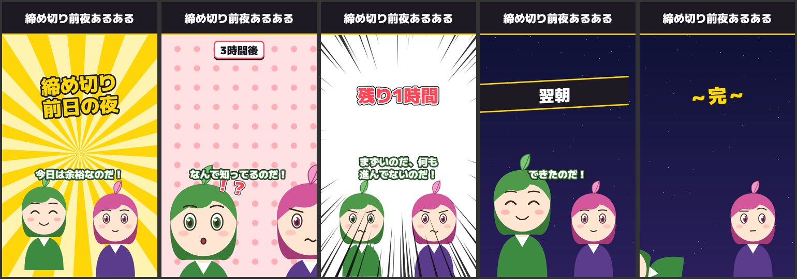
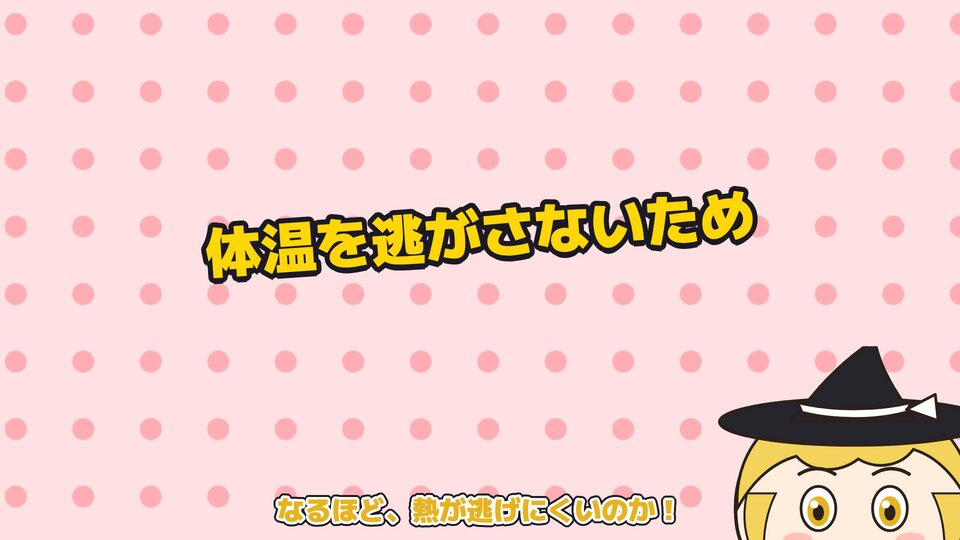
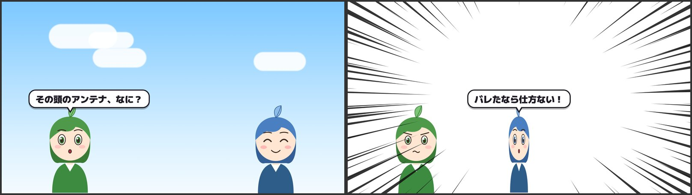
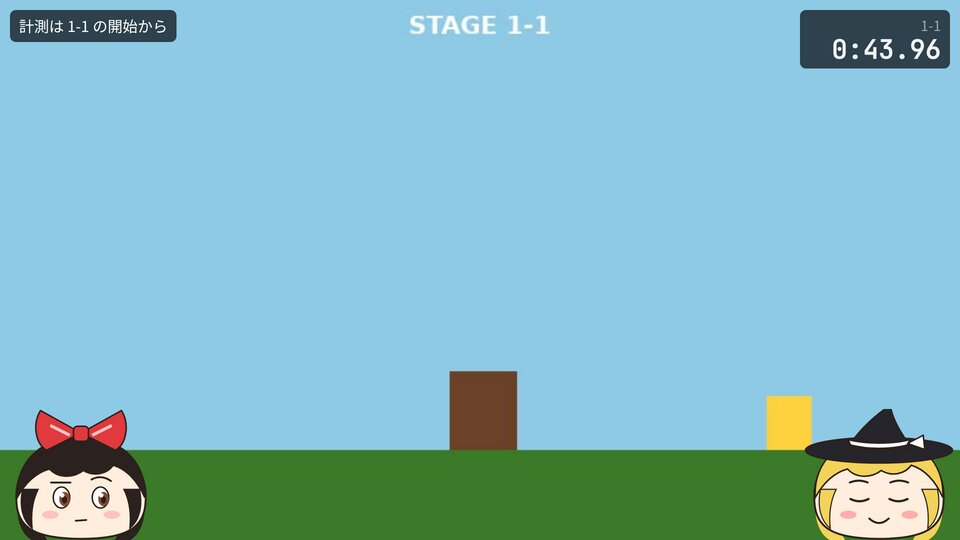

# ネタ動画・ショート・ゆっくり・寸劇（`layout: skit`）

台詞を書き、その間に「指示の行」（`!caption` `!se` …）と文頭の印（`{act:jump}` `{fx:zoom}` `{se:don}`）を挟むだけで、
テロップ・効果音・画面効果・キャラクターの動きが台詞のタイミングに合って入る。秒数は書かない（間だけ `!wait` で足せる）。

```sh
./bin/gmm.mjs new short scripts/my-short.md     # 見本から台本を作る（short / yukkuri / anime / yukkuri-game）
./bin/gmm.mjs se list                           # 効果音・動き・画面効果・テロップの一覧
./bin/gmm.mjs check scripts/my-short.md && ./bin/gmm.mjs frames scripts/my-short.md --steps
./bin/gmm.mjs render scripts/my-short.md
```

| 見本 | 型 | 画面 |
| --- | --- | --- |
| [examples/skit/short.md](../examples/skit/short.md) | 縦長ショートのあるある（`format: short` `style: meme`） |  |
| [examples/skit/yukkuri.md](../examples/skit/yukkuri.md) | ゆっくり解説（`style: yukkuri`） |  |
| [examples/skit/anime.md](../examples/skit/anime.md) | 吹き出しの寸劇（`style: anime`） |  |
| [examples/rta/yukkuri-run.md](../examples/rta/yukkuri-run.md) | ゲーム録画のゆっくり実況（`layout: biim` `biimFrame: yukkuri`） |  |

## フロントマター

```yaml
---
title: 締め切り前夜あるある
layout: skit
format: short          # wide（16:9・既定）/ short（9:16・ショート動画）/ square（1:1）
style: meme            # meme（太い字幕・派手な背景）/ yukkuri（まんじゅう型・色付きの字幕）/ anime（吹き出し）
subtitleStyle: bold    # 省略可。yukkuri / bubble / bold / box / none（既定は style で決まる）
banner: 締め切り前夜あるある   # 省略可。画面の上に出し続ける帯（ショートの題名）
speakers:              # 話者: 声（書いた順に左・右・真ん中に立つ）
  ずんだもん: zundamon
  めたん: "metan pitch=0.05 speed=1.2"   # 声の高さ・抑揚・速さ・音量を変えられる（pitch intonation speed volume）
characters:            # 話者: 立ち絵
  ずんだもん: builtin
  めたん: builtin-metan
bgm: maou:...          # 省略可（gmm bgm list）
---
```

- 話者が1人なら、台詞の頭の「名前:」は省略できる。`speakers:` を書かずに `character:` と `voice:` だけでもよい（ナレーターが1人立つ）
- 立ち絵は解説動画と同じ（`builtin` / `builtin-metan` / `builtin-blue` / `characters/<名前>/`）に加えて、
  ゆっくり風の**まんじゅう型**：`manju-red`（赤いリボン）/ `manju-witch`（黒い帽子）/ `manju-green`（葉っぱ）。表情は normal / smile / surprised / troubled / think
- テーマの既定は `pop`（白地に赤と黄色）。場面転換のチャイムは鳴らさない（効果音は `!se` で入れる）

## 場面

```markdown
## 起 bg=sunburst transition=flash
```

- `bg=`：`#ffcc00` のような色 / 模様 `sunburst`（回る放射）`dots` `stripes` `gradient` `sky` `speed`（集中線）`night` /
  画像（`.png` `.jpg` …）/ 動画（`.mp4` `.webm` `.mov`。音なしでループ）。台本からの相対パス。省略すると前の場面の背景のまま
- `transition=`：`cut`（既定）/ `fade` / `flash` / `slide` / `zoom` / `wipe`
- 誰がどこに立っているか・表情・向きは、次の場面に引き継ぐ

## 台詞と文頭の印

```markdown
めたん: {face:troubled}{act:shake}{fx:zoom}{se:don}それ、昨日も言ってたわね。
```

`。！？` と改行で文に分かれ、文の頭の印はその文が始まるときに起きる。

| 印 | 意味 |
| --- | --- |
| `{face:表情}` | 話者の表情（次の指定まで続く） |
| `{act:動き}` | 話者が動く。`{act:名前:動き}` で話者以外も |
| `{fx:効果}` | 画面効果 |
| `{se:名前}` | 効果音（組み込みの名前か、台本からの相対パス） |
| `{表記\|よみ}` | 字幕は表記、読み上げはよみ（解説動画と同じ。`readings:` も使える） |

**動き**（`{act:…}` / `!act`）

| 名前 | 動き | |
| --- | --- | --- |
| `jump` | ぴょんと跳ねる | 一瞬 |
| `shake` | ぶるぶる横に揺れる | 一瞬 |
| `nod` | うなずく | 一瞬 |
| `spin` | くるっと回る | 一瞬 |
| `flip` | 向きを変える | 次の flip まで |
| `grow` | 大きくなる（ドーン） | 次の台詞まで |
| `shrink` | 小さく暗くなる（しょんぼり） | 次の台詞まで |
| `fall` | 外側に倒れる（ズコー） | 次の台詞まで |
| `tremble` | ガクガク震える | 次の台詞まで |

**画面効果**（`{fx:…}` / `!fx`）：`shake`（画面が揺れる）/ `flash`（白く光る）/ `zoom`（話者の顔に寄る。次の台詞まで）/
`lines`（集中線。次の台詞まで）/ `mono`（白黒・回想。次の台詞まで）

**効果音**：`gmm se list`。すべてコードで合成した音なので、権利表記はいらない。

| 名前 | 音 | 使いどころ |
| --- | --- | --- |
| `don` / `dodon` | ドン / ドドン | テロップ・衝撃の一言 / 大発表 |
| `chin` | チーン | オチ・残念 |
| `pon` / `pyu` | ポン / ピュッ | 軽く出す・ひらめき |
| `kira` | キラーン | 決め |
| `boyon` | ボヨン | ジャンプ・間抜け |
| `whoosh` | ヒュッ | 移動・登場 |
| `buzzer` / `pinpon` | ブブー / ピンポン | 不正解 / 正解 |
| `zukoo` | ズコー | ずっこけ |
| `drumroll` | ドラムロール | 発表の前の溜め |
| `jaan` / `gaan` | ジャーン / ガーン | 登場・発表 / ショック |

## 指示の行

`!` で始まる行。**次の台詞が始まるとき**に起きる。場面の最後（後ろに台詞がない所）に書いた指示は、最後の台詞の後に起き、
その後に 1.4 秒の余韻を取る（オチの `!se chin` や `!caption ～完～` に使う）。

| 指示 | 意味 |
| --- | --- |
| `!caption 文字 style=impact pos=center` | テロップ。次の `!caption` か場面の終わりまで出る（`!caption` だけで消す）。`\n` で改行 |
| `!stamp ！？ pos=auto` | 飾り文字（！？・草・ｗ など6文字まで）。次の台詞まで。auto は話者の頭の横 |
| `!pic cat.png pos=center size=0.8 in=pop` | 画像。次の `!pic` か場面の終わりまで（`!pic` だけで消す）。in=：pop / slide / zoom / fade |
| `!enter 名前 right` / `!exit 名前` / `!move 名前 center` | 出入り・移動（left / center / right か 0〜100 の数） |
| `!act 名前 jump` / `!face 名前 surprised` | 話者以外を動かす・表情を変える（リアクション） |
| `!fx shake` / `!se don` | 画面効果・効果音（話者に結びつけたくないとき） |
| `!wait 1.5` | 次の台詞の前に間を置く（秒。ボケの後の「間」） |

**テロップの style**：`impact`（黄色の極太。ドン！と出る）/ `shout`（赤く震える）/ `pop`（白い札。上に出る）/
`note`（小さい補足。下に出る）/ `title`（画面を横切る帯。起承転結の見出し・「翌朝」など）。
`pos=`：top / center / bottom / left / right / tl / tr / bl / br。

## 型ごとのコツ

- **ショート（`format: short`）**：最初の 2 秒で `!caption … style=impact` と `!se dodon` で掴む。`banner:` に題名。
  台詞は 1 文 3 秒以内、場面は 4〜6 個、全体 20〜60 秒。起（あるある）→ 承（悪化）→ 転（`speed` の集中線）→ 結（オチ ＋ `chin`）
- **ゆっくり（`style: yukkuri`）**：`manju-red` と `manju-witch` の 2 人。挨拶「ゆっくりしていってね」→ 問い → 答え（`!caption` で要点）→ オチ。
  ボケた後は相手の `{act:shake}` と `buzzer` でツッコミ。補足は `style=note`
- **寸劇（`style: anime`）**：吹き出しが話者の頭の上に出る。`!exit` で最初は隠しておき `!enter … right` と `whoosh` で登場させる。
  驚きは `{fx:flash}{se:don}`、正体を明かす所は `{fx:lines}{act:spin}{se:kira}`
- 効果音は 1 台詞に 1 つまで。毎台詞に鳴らすとうるさい。強い効果（zoom・lines・flash）は 1 場面に 1 回

## 外部の読み上げソフト（AquesTalk など）

声に `exec:<名前>` と書くと、利用者の設定ファイルに書いたコマンドで読み上げる（ゆっくりの声を使いたいとき）。
設定は **利用者が自分で置く** ファイル（台本からコマンドを実行させないため）：環境変数 `GMM_VOICES` のパス、なければ `~/.config/gmm/voices.json`。

```json
{
  "reimu": { "command": ["AquesTalkPlayer", "/T", "{text}", "/W", "{out}", "/P", "れいむ"], "credit": "音声: AquesTalk" }
}
```

```yaml
speakers:
  あか: exec:reimu
```

`{text}` は読み上げる文、`{out}` は書き出す WAV のパス（シェルは通さない）。できた音声は ffmpeg でそろえ、口パクは音の大きさから推定する。
ソフトの利用規約（商用・クレジット）は利用者が確かめる。`credit` は `credits.txt` に書かれる。

## 検査（gmm check）

台詞・テロップ・画像・スタンプが出て落ち着いたフレームごとに測る。

- 文字・テロップ・画像が画面からはみ出していないか、テロップ・画像・上の帯どうし／字幕と重なっていないか、字幕が 2 行を超えないか
- 台詞が長すぎないか（8 秒）、大きなテロップが 1 行 14 文字を超えないか、テロップがすぐ消えないか（0.8 秒）、スタンプが長くないか
- 立ち絵・スタンプ・背景は重ねて使うものなので、重なりは見ない（キーフレームで目で確かめる）

`gmm frames --steps` は、各台詞・テロップが出た所を撮る。縦長の動画は `overview.png` に細いコマを 6 列で並べる。
